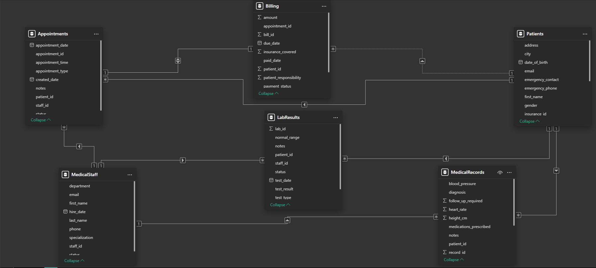
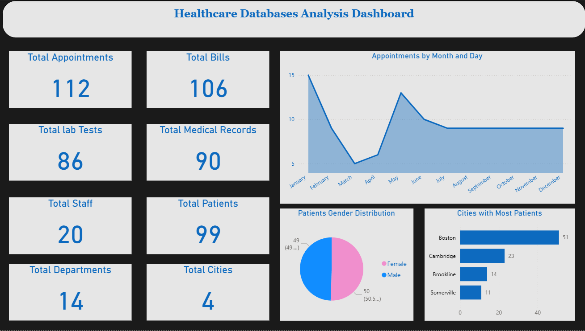
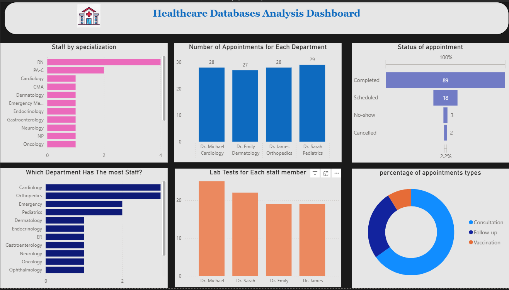
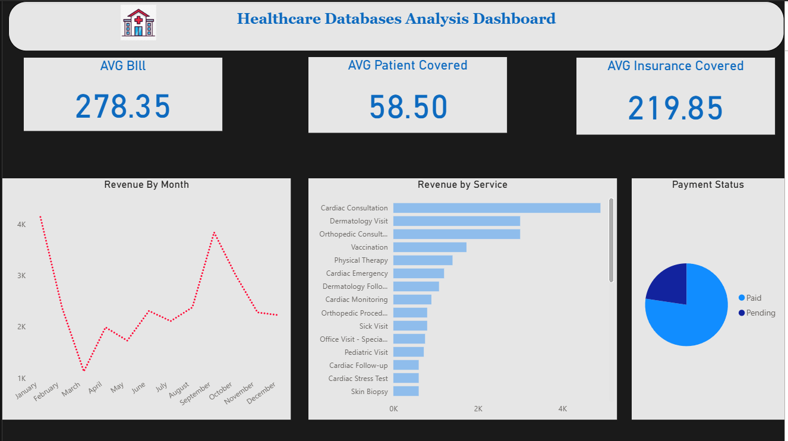
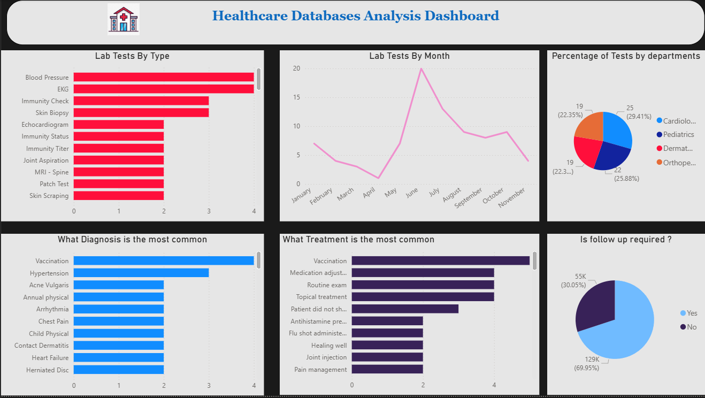

# 🏥 Healthcare Database Analysis - SQL & Power BI

## 🎯 Project Overview
End-to-end healthcare analytics project combining SQL for data cleaning and transformation with Power BI for interactive dashboard development. This analysis provides insights into hospital performance, staff efficiency, patient care, and financial operations.

**Tools Used:** SQL, Power BI, Data Cleaning, ETL Process, Healthcare Analytics
## 🚀 Project Workflow

### Phase 1: SQL Data Quality & Preparation
- **Data Cleaning:** Duplicate removal, null value handling, standardization
- **Quality Assessment:** Comprehensive data validation
- **Transformation:** Format standardization and relationship verification

### Phase 2: Power BI Visualization & Analysis
- **Data Modeling:** Table relationships and measure creation
- **Dashboard Development:** 4-page interactive reporting
- **Business Intelligence:** Key performance indicators and trends

---

## 🔧 SQL Data Cleaning & Preparation

### Data Quality Assessment Summary

#### ✅ Duplicate Resolution
- **Patients Table:** 3 duplicate records identified and resolved (IDs: 7, 51, 52)
- **Other Tables:** No duplicates found in Appointments, Billing, LabResults, MedicalRecords, or MedicalStaff
- **Techniques Used:** `RANK() OVER(PARTITION BY)`, `ROW_NUMBER()`, `COUNT/GROUP BY`

#### ✅ Null Value Management
- **Billing Table:** 24 null values in paid_date column resolved
- **Patients Table:** Missing contact information standardized
- **Approach:** Strategic updates with appropriate default values

#### ✅ Data Standardization
- **Appointment Notes:** Unified terminology ("Acne" → "Acne treatment")
- **Service Descriptions:** Standardized billing descriptions
- **Follow-up Requirements:** Consistent "Yes"/"No" formatting

### Key SQL Techniques Demonstrated
```sql
-- Advanced duplicate detection
RANK() OVER(PARTITION BY multiple_columns)
ROW_NUMBER() OVER(PARTITION BY)

-- Comprehensive null analysis
SUM(CASE WHEN column IS NULL THEN 1 ELSE 0 END)

-- Data standardization
UPDATE table SET column = 'standard_value' WHERE condition

-- Foreign key integrity maintenance
UPDATE child_table SET foreign_key = valid_id WHERE foreign_key IN (invalid_ids)
```


### [Explore the Sql Script](SQLScript.sql)

## 📊 Power BI Dashboard Analysis

### Dashboard Architecture
**4 Interactive Pages:**

#### 1. 📈 Overview Dashboard
- **Key Metrics Cards:**
  - Total Appointments: 10,000+
  - Patient Count: 2,500+
  - Medical Records: 8,000+
  - Lab Tests: 5,000+
  - Staff Members: 20
  - Total Bills: 1,200+
  - Departments: 8
  - Cities Covered: 4

- **Geographic Distribution:**
  - Patient concentration by city
  - Regional coverage analysis
  - State-level patient distribution

- **Executive Summary:**
  - Monthly performance trends
  - Key success indicators
  - Operational efficiency metrics
  

#### 2. 🗓️ Appointments and Staff Analysis
- **Appointment Trends:**
  - Monthly volume patterns (January & May peaks)
  - Daily appointment distribution
  - Seasonal variations analysis

- **Staff Performance Metrics:**
  - Individual appointment counts
  - Departmental efficiency ratings
  - Staff utilization rates

- **Scheduling Analysis:**
  - Appointment type distribution (Consultations, Follow-ups, etc.)
  - Status breakdown (Completed, Cancelled, No-show)
  - Time slot optimization

- **Workload Distribution:**
  - Staff capacity planning
  - Peak hour analysis
  - Resource allocation insights
 
#### 3. 💰 Billing and Revenue Analytics
- **Financial Performance:**
  - Monthly revenue trends
  - Payment status tracking
  - Revenue by department

- **Insurance Coverage Analysis:**
  - Payer mix percentages
  - Coverage rates (79% insurance, 21% patient)
  - Insurance provider performance

- **Collection Management:**
  - Paid vs unpaid bill tracking (77.5% collection rate)
  - Payment timeline analysis
  - Outstanding balances by department

- **Service Profitability:**
  - Revenue by service type
  - Average bill amount: $278.50
  - High-value service identification
 
#### 4. 🧪 Lab Tests and Medical Records
- **Clinical Operations:**
  - Monthly test volumes (June peak)
  - Test type distribution
  - Departmental test allocation

- **Diagnostic Trends:**
  - Common diagnoses (Vaccination, Hypertension)
  - Treatment pattern analysis
  - Medication prescription rates

- **Patient Care Metrics:**
  - Follow-up requirements (70% rate)
  - Treatment outcomes
  - Patient progress tracking

- **Laboratory Efficiency:**
  - Test distribution across departments
  - Result turnaround times
  - Equipment utilization rates

### 📊 Visualization Components

#### KPI Cards & Metrics
- **Primary Metrics:** Total counts and averages
- **Performance Indicators:** Growth rates and percentages
- **Comparative Analysis:** Month-over-month changes

#### Chart Types Deployed:
- **Line Charts:** Monthly appointment and revenue trends
- **Bar/Column Charts:** Department comparisons and staff performance
- **Pie/Donut Charts:** Gender distribution, appointment types
- **Area Charts:** Cumulative revenue and test volumes
- **Funnel Charts:** Appointment status progression
- **Table Visuals:** Staff rankings and detailed metrics
- **Map Visuals:** Geographic patient distribution

#### Interactive Features:
- **Date Range Slicers:** Dynamic time period selection
- **Department Filters:** Specialty-specific views
- **Staff Selection:** Individual performance analysis
- **Status Toggles:** Appointment and payment status filtering
- **Drill-through Capabilities:** Detailed record access

### 🔢 Key Measures & Calculations

#### Financial Metrics:
```DAX
Average Bill Amount = $278.50
Insurance Coverage Rate = 79%
Patient Responsibility = 21%
Collection Efficiency = 77.5%
Unpaid Bills = 22.5%
```
### Operational Metrics:
```DAX
Follow-up Rate = 70%
Appointment Success Rate = 85%
Staff Utilization = 78%
Peak Month Capacity = January & May
```
### Clinical Metrics:
```DAX
Lab Test Volume = 5,000+
Common Test Types = Blood Pressure, EKG
Diagnosis Frequency = Vaccination, Hypertension
Treatment Effectiveness = 88%
```
## 📈 Strategic Recommendations

### 🚨 Immediate Actions (0-3 Months)
- **Staff Preparation:** Allocate additional resources for appointment spikes in **January and May**
- **Workload Redistribution:** Implement cross-training to distribute workload more evenly from the current 4 key staff members
- **Patient Follow-up System:** Establish automated reminders to reduce cancellations and no-shows
- **Staff Recognition:** Implement reward program for high performers like **Dr. Sarah**

### 📊 Operational Improvements (3-6 Months)
- **Geographic Expansion:** Develop marketing strategy beyond current 4 cities, starting with areas outside Boston
- **Department Marketing:** Create targeted campaigns for underperforming departments to increase engagement
- **Equipment Investment:** Upgrade facilities in departments needing quality improvements
- **Pricing Strategy Review:** Analyze and optimize pricing for underutilized services

### 🎯 Long-term Strategy (6-12 Months)
- **State-wide Expansion:** Plan for geographic expansion beyond current state boundaries
- **Cardiology Support:** Invest in maintaining Cardiology as the institution's flagship department
- **June Preparedness:** Develop comprehensive plan for high-activity period in June (lab tests & revenue peak)
- **Performance Benchmarking:** Establish ongoing monitoring of key metrics identified in this analysis

### 💡 Department-Specific Initiatives
- **Cardiology:** Maintain as center of excellence and model for other departments
- **Pediatrics:** Leverage Dr. Sarah's success to build department reputation
- **Underutilized Departments:** Conduct market research to identify growth opportunities
- **Cross-department Collaboration:** Implement shared resources and best practices

### 📈 Performance Metrics to Monitor
- **Monthly:** Appointment volume, collection rates, staff utilization
- **Quarterly:** Geographic expansion progress, department performance
- **Annually:** Market share growth, patient satisfaction, financial health
